# SeaDataNet Software Ecosystem

> **Status snapshot: October 2026**  
> This page documents the SeaDataNet software ecosystem used to **prepare, validate, harmonise and replicate marine data and metadata**. It deliberately stops at the central **Import Manager / EUDAT** layer and does not describe the CDI discovery portal itself.

The ecosystem is evolving from a set of historically private Java applications towards a more open, FAIR and maintainable software stack. The first diagram gives a deliberately simplified functional overview; the following sections add publication status, technical dependencies and modernisation details.

## At a glance

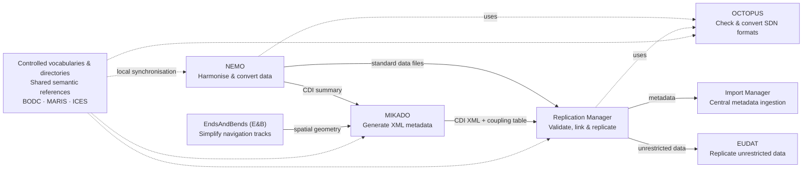

This overview is intentionally functional: it shows **what each component does and how the main data/metadata flows connect**. Openness, repository visibility, FAIRisation and modernisation status are shown in the detailed ecosystem view below.

## Software ecosystem

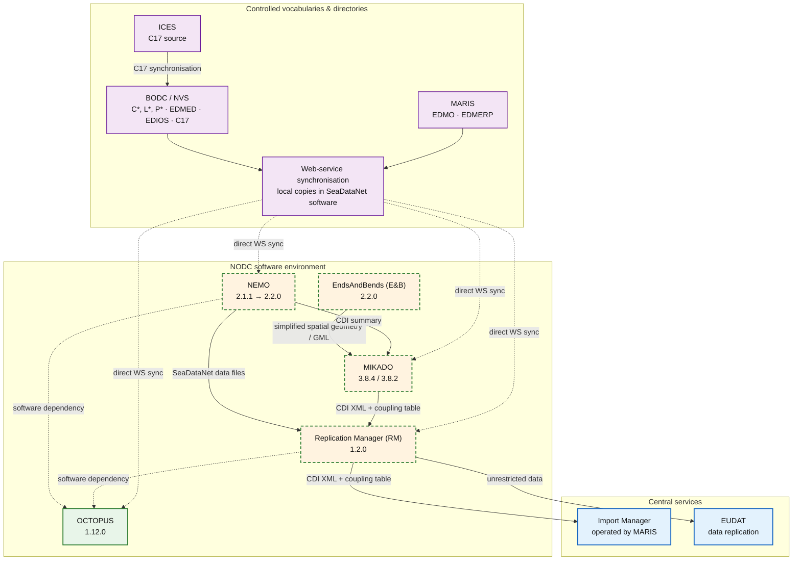

### Legend

| Visual status | Meaning |
|---|---|
| **Green** | Public/open-source and FAIRised |
| **Orange + dashed green border** | Private today, with public release / FAIRisation planned or in progress |
| **Blue** | External or centrally operated service |
| **Purple** | Shared semantic reference layer |

> **Restricted data are not replicated to EUDAT.** They remain at the originating NODC. Their CDI metadata are still transferred through the Replication Manager workflow.

## Core software

| Logo | Software | Maintainer / operator | Current version | Java / runtime | Current licence | FAIR / publication status | Private repository | Public repository |
|---|---|---|---|---|---|---|---|---|
|  | **OCTOPUS** | Ifremer | **1.12.0** | OpenJDK 11+ | **LGPL v3** | **FAIRised** and public | [Ifremer GitLab](https://gitlab.ifremer.fr/seadatanet/applications/octopus) | [github.com/seadatanet/octopus](https://github.com/seadatanet/octopus) |
| 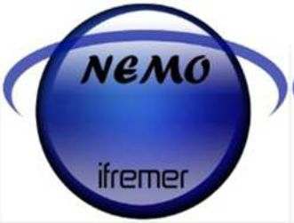 | **NEMO** | Ifremer | **2.1.1** → **2.2.0 upcoming** | JDK 8 → OpenJDK 11+ | SeaDataNet 1.0 → **LGPL v3** | FAIRisation + public release planned with 2.2.0 | [Ifremer GitLab](https://gitlab.ifremer.fr/seadatanet/applications/nemo) | [github.com/seadatanet/nemo](https://github.com/seadatanet/nemo) *(repository created; code publication planned)* |
| 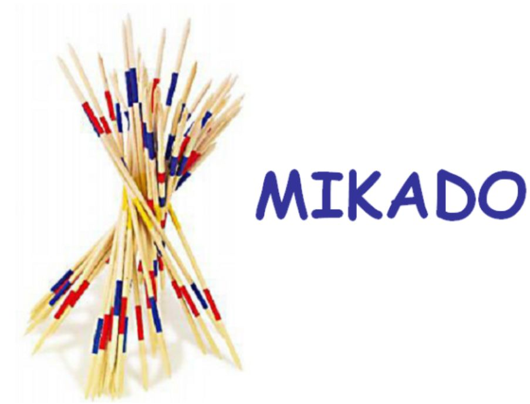 | **MIKADO** | Ifremer | **3.8.4** / **3.8.2** | Java 21 / Jakarta; legacy JDK 8 line | SeaDataNet 1.0 → **LGPL v3** | FAIRisation and public release planned | [Ifremer GitLab](https://gitlab.ifremer.fr/seadatanet/applications/mikado-software) | <https://github.com/seadatanet/mikado> *(planned)* |
|  | **Replication Manager (RM)** | Ifremer | **1.2.0** | JDK 8; Tomcat < 10 | SeaDataNet 1.0 → **LGPL v3** | FAIRisation and public release planned | [Ifremer GitLab](https://gitlab.ifremer.fr/seadatanet/applications/ReplicationManager) | <https://github.com/seadatanet/rm> *(planned)* |
|  | **EndsAndBends (E&B)** | Ifremer | **2.2.0** | Java 21; OpenJDK / Azul Zulu build | SeaDataNet 1.0 → **LGPL v3** | FAIRisation and public release planned in the near term | **TBD – Ifremer GitLab project URL** | <https://github.com/seadatanet/endsandbends> *(planned publication)* |
| 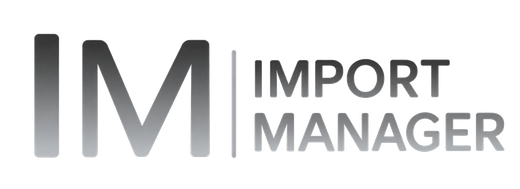 | **Import Manager** | MARIS | **TBD** | Central web application | **TBD** | Externally operated; source status to document | — | — |

### Main roles

- **OCTOPUS** — multiformat checker, splitter and converter for SeaDataNet formats. It validates and converts MedAtlas, ODV and NetCDF/CF data and provides format-processing capabilities used by both NEMO and Replication Manager.
- **NEMO** — harmonises heterogeneous marine data into SeaDataNet exchange formats (ODV, MedAtlas and NetCDF/CF) and can produce a CDI summary used by MIKADO.
- **MIKADO** — prepares and manages SeaDataNet XML metadata for EDMED, CSR, EDMERP, CDI and EDIOS. It can work manually or generate metadata from local databases / CSV files. It also generates the coupling table used by Replication Manager.
- **Replication Manager** — one instance is typically deployed by each NODC. It synchronises data and CDI metadata with the central SeaDataNet infrastructure, performs consistency/format checks, handles data-access workflows, transfers CDI XML and the coupling table to Import Manager, and replicates unrestricted data to EUDAT.
- **EndsAndBends (E&B)** — simplifies raw vessel navigation tracks while preserving their geometry, producing spatial objects suitable for CDI/CSR records and GIS use. Its GML output can be injected into MIKADO files.
- **Import Manager** — MARIS-operated central web component receiving CDI metadata and coupling information from NODC Replication Manager instances and supporting ingestion/administration of the central workflow.

## Technical dependencies

The functional diagram above intentionally hides most implementation details. The following view exposes the main **confirmed software dependencies** that are useful for understanding the SeaDataNet client stack, while omitting purely internal Ifremer utility libraries.

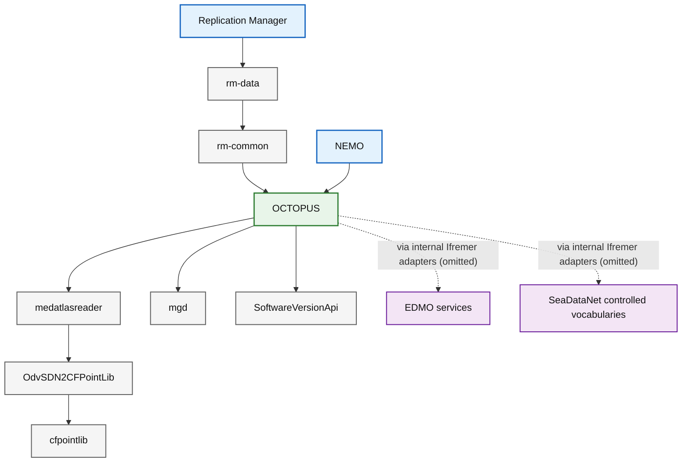

This dependency view is deliberately **not an exhaustive library inventory**. In particular, internal Ifremer utility libraries are not shown when they do not help an external SeaDataNet developer understand the public architecture. Detailed versioning, licensing and lifecycle information for `rm-data`, `rm-common` and the OCTOPUS support libraries can be documented later as the technical inventory is consolidated.

The confirmed RM dependency chain is therefore:

```text
Replication Manager → rm-data → rm-common → OCTOPUS
```

OCTOPUS is also a direct dependency of NEMO and provides shared SeaDataNet format checking and conversion capabilities.

## Modernisation trajectory

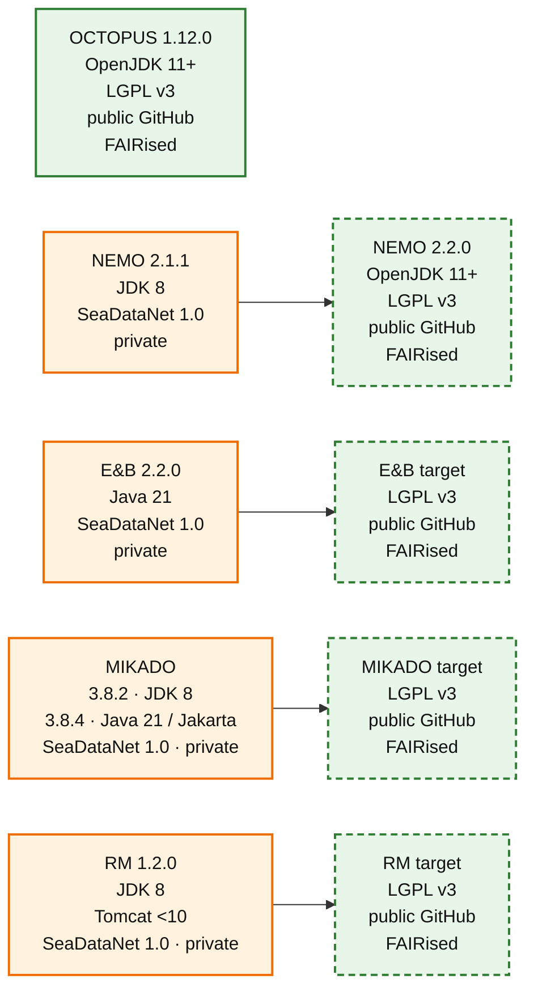

The trajectory combines several dimensions of technical-debt reduction:

- migration away from legacy JDK 8 components where a modern runtime is already defined;
- migration from the **SeaDataNet 1.0 licence** to **LGPL v3**;
- progressive publication of source code in the **SeaDataNet GitHub organisation**;
- FAIRisation of software metadata, documentation, licensing and citation information.

For RM, a future runtime upgrade may be desirable, but no target Java/Tomcat version is documented here yet.

## Controlled vocabularies and directories

SeaDataNet software relies on shared semantic resources that are synchronised locally through web services. These resources provide a common reference layer across data and metadata workflows.

| Logo | Organisation | Main SeaDataNet resources | Notes |
|---|---|---|---|
| 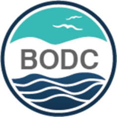 | **BODC / NVS** | SeaDataNet controlled vocabularies (`C*`, `L*`, `P*`), EDMED, EDIOS, exposed C17 | Main vocabulary web-service provider used by SeaDataNet applications |
| 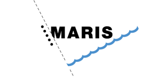 | **MARIS** | EDMO, EDMERP | Directories exposed through MARIS web services |
| 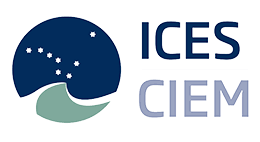 | **ICES / CIEM** | C17 source | C17 is created/maintained by ICES, synchronised to BODC and exposed through the BODC service |

OCTOPUS, NEMO, MIKADO and Replication Manager each contact the relevant web services directly to maintain a local copy. The use of SeaDataNet vocabularies by EndsAndBends is still to be confirmed.

## Central services

| Logo | Service | Organisation / operator | Role |
|---|---|---|---|
|  | **Import Manager** | **MARIS** | Receives **CDI XML + coupling table** from Replication Manager instances. The coupling table links CDI metadata to the corresponding data files. |
| 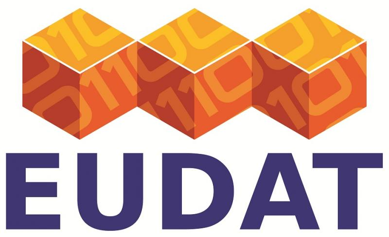 | **EUDAT** | **EUDAT** | Receives replicated **unrestricted data** from Replication Manager. Restricted data remain at the originating NODC. |

## Maintainer

Most client-side SeaDataNet software described here is developed and maintained by:


**Ifremer** — Institut français de recherche pour l'exploitation de la mer.

## Known documentation gaps

This first ecosystem view intentionally keeps a few items explicit rather than guessing them:

- exact private Ifremer GitLab URL for **EndsAndBends**;
- **Import Manager** current version, licence and source-code repository status;
- confirmation of whether **EndsAndBends** directly consumes SeaDataNet controlled vocabularies;
- any future Java/Tomcat target for **Replication Manager**.

These points can be completed as the software inventory is consolidated.
